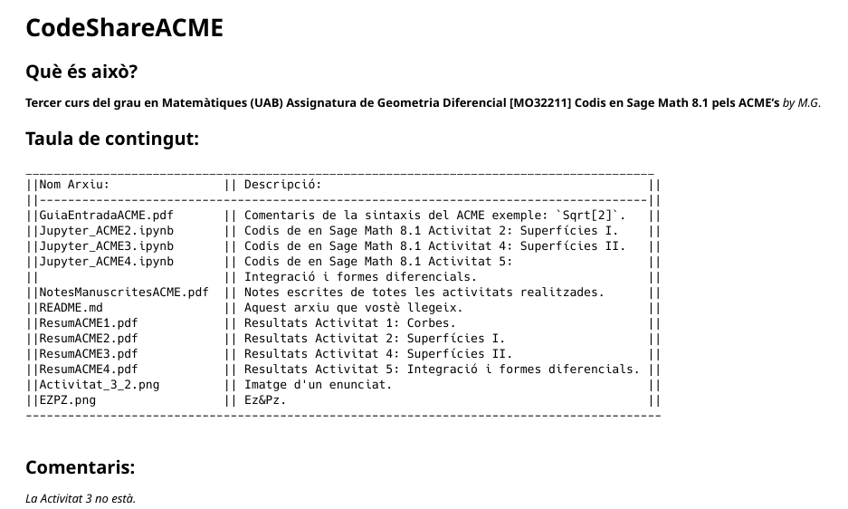

# Resum del contingut 
Aquest repositori conté tots els materials (demanar *.zip i *.mp4) de l'assignatura **Geometria Diferencial [MO32211]** del **3r curs** del **Grau en Matemàtiques** impartit a la *Facultat de ciències* pel *Departament de Matemàtiques* a la *Universitat Autònoma de Barcelona* durant el *segon semestre* del curs  acadèmic *2019-2020*. El professorat d'aquesta assignatura s'ho ha _currat_ molt, calia emmagatzemar-ho de forma ben estructurada. 

```Haskell
.
├── GD_01_TEORIA
│   ├── GD_AmpliacioAgustiR
│   ├── GD_ApuntsMarcelN
│   └── GD_UnitatsVideoMesManuscritsTeoria
├── GD_02_PROBLEMES
│   ├── GD_EnunciatsLlistesDeProblemes20192020
│   ├── GD_ResolucioProblemesVideo
│   ├── GD_SolucionsLlistesDeProblemes20172018
│   └── GD_SolucionsLlistesDeProblemes20192020
├── GD_03_AVALUACIO
│   ├── GD_ACME
│   ├── GD_ExemplesEntregues
│   ├── GD_Noticies
│   └── GD_PreparacioExamens
├── GD_04_SEMINARIS
│   └── GD_Seminaris
├── GD_ImatgeReadme001.png
└── README.md
```

## `./GD_01_TEORIA/`
### Teoria (Vídeos) `./GD_01_UnitatsVideoMesManuscritsTeoria`
|**Direcció relativa**| **Detalls sobre el contingut**              |
|--------------------|----------------------------------------------|
|`./GD_Unitat_01.zip`|Unitat 1 (primera forma fonamental) `*.zip > *.mp4 +*.pdf`              |
|`./GD_Unitat_02.zip`|Unitat 2 (aplicació de Gauss) `*.zip > *.mp4 +*.pdf`                    |
|`./GD_Unitat_03.zip`|Unitat 3 (endomorfisme de Weingarten)`*.zip > *.mp4 +*.pdf`             |
|`./GD_NotesUnitat03.pdf`| Transcripció de la veu de la Unitat 3 `*.pdf`                       |
|`./GD_Unitat_04.zip`|Unitat 4 (curvatura normal) `*.zip > *.mp4 +*.pdf`                      |
|`./GD_Unitat_05.zip`|Unitat 5 (L'aplicació de Gauss en coordenades) `*.zip > *.mp4 +*.pdf`   |
|`./GD_Unitat_06.zip`|Unitat 6 (L'aplicació de Gauss en coordenades II) `*.zip > *.mp4 +*.pdf`|
|`./GD_NotesUnitat06.pdf`| Transcripció de la veu de la Unitat 6 `*.pdf`                       |
|`./GD_Unitat_07.zip`|Unitat 7 (L'aplicació de Gauss. Coda) `*.zip > *.mp4 +*.pdf`            |
|`./GD_Unitat_08.zip`|Unitat 8 (Teorema Egregi de Gauss) `*.zip > *.mp4 +*.pdf`               |
|`./GD_Unitat_09.zip`|Unitat 9 (transport paral·lel) `*.zip > *.mp4 +*.pdf`                   |
|`./GD_Unitat_10.zip`|Unitat 10 (geodèsiques) `*.zip > *.mp4 +*.pdf`                          |
|`./GD_Unitat_11.zip`|Unitat 11 (geodèsiques. exemples) `*.zip > *.mp4 +*.pdf`                |
|`./GD_Unitat_12.zip`|Unitat 12 (curvatura geodèsica) `*.zip > *.mp4 +*.pdf`                  |
|`./GD_Unitat_13.zip`|Unitat 13 (camps vectorials) `*.zip > *.mp4 +*.pdf`                     |
|`./GD_Unitat_14.zip`|Unitat 14 (algebra multilineal I) `*.zip > *.mp4 +*.pdf`                |
|`./GD_Unitat_15.zip`|Unitat 15 (algebra multilineal II) `*.zip > *.mp4 +*.pdf`               |
|`./GD_Unitat_16.zip`|Unitat 16 (formes diferencials I) `*.zip > *.mp4 +*.pdf`                |
|`./GD_Unitat_17.zip`|Unitat 17 (formes diferencials II) `*.zip > *.mp4 +*.pdf`               |
|`./GD_U_17_erratum.pdf`|Unitat 17 **erratum Fitxer** `*.pdf`                                 |
|`./GD_Unitat_18.zip`|Unitat 18 (subvarietats de R^n) `*.zip > *.mp4 +*.pdf`                  |
|`./GD_Unitat_19.zip`|Unitat 19 (subvarietats amb vora) `*.zip > *.mp4 +*.pdf`                |
|`./GD_Unitat_20.zip`|Unitat 20 (orientació) `*.zip > *.mp4 +*.pdf`                           |
|`./GD_U_20_erratum.pdf`|Unitat 20 erratum Fitxer `*.pdf`                                     |
|`./GD_Unitat_21.zip`|Unitat 21 (integració de formes diferencials) `*.zip > *.mp4 +*.pdf`    |
|`./GD_Unitat_22.zip`|Unitat 22 (teorema de Stokes) `*.zip > *.mp4 +*.pdf`                    |
|`./GD_Unitat_23.zip`|Unitat 23 (càlcul vectorial) `*.zip > *.mp4 +*.pdf`                     |
|`./GD_Unitat_24.zip`|Unitat 24 (Teorema de Gauss-Bonnet I) `*.zip > *.mp4 +*.pdf`            |
|`./GD_U_24_erratum.pdf`|Unitat 24 **erratum Fitxer** `*.pdf`                                 |
|`./GD_Unitat_25.zip`|Unitat 25 (Teorema de Gauss-Bonnet II) `*.zip > *.mp4 +*.pdf`           |

### Teoria (Capítols) `./GD_ApuntsMarcelN`
| **Direcció relativa**      | **Detalls sobre el contingut**               |
|----------------------------|----------------------------------------------|
|`./GD_1ApuntsMarcelN.pdf`   |**1.** Corbes Diferenciables                                                        |
|`./GD_2i3ApuntsMarcelN.pdf` |**2.** Subvarietats de R^n + **3.** Primera forma fonamental Fitxer (Arxiu `*.pdf `)|
|`./GD_4ApuntsMarcelN.pdf`   |**4.** Aplicació de Gauss i segona forma fonamental Fitxer (Arxiu `*.pdf `)         |
|`./GD_5ApuntsMarcelN.pdf`   |**5.** Geometria intrínseca de superfícies Fitxer (Arxiu `*.pdf `)                  |
|`./GD_6ApuntsMarcelN.pdf`   |**6.** Formes Diferencials Fitxer (Arxiu `*.pdf `)                                  |
|`./GD_7ApuntsMarcelN.pdf`   |**7.** Integració Fitxer (Arxiu `*.pdf `)                                           |
|`./GD_8ApuntsMarcelN.pdf`   |**8.** Teorema de Gauss-Bonnet (Arxiu `*.pdf `)                                     |

### Material complementari (Documents) `./GD_AmpliacioAgustiR`
> Comentari sobre **Picapiedra**: deixo un problema que varem parlar a classe però no és perquè el feu sinó tan sols perquè tingueu l'enunciat precís per si algun dia us avorriu (o ens tornen a confinar)

| **Direcció relativa**      | **Detalls sobre el contingut**               |
|----------------------------|----------------------------------------------|
|`./GD_ApuntsAgustiR455.pdf` | Notes geometria diferencial (Arxiu `*.pdf ` de `455`  pàgines)|
|`./GD_GaspardMonge.pdf`     | Notes sobre Gaspard Monge (Arxiu `*.pdf ` de `35`  pàgines)   |
|`./GD_EvolutesAgustiR.pdf`  | Evolutes (Arxiu `*.pdf ` de `16`  pàgines)           |
|`./GD_HisoriaAgustiR391.pdf`| Notes Històriques inicis geometria diferencial (Arxiu `*.pdf ` de `391`  pàgines)|
|`./GD_FlinStone.pdf`        | Els Picapiedra (Arxiu `*.pdf ` de `2`  pàgines) |
|`./GD_ResumTeoremesClas.pdf`| Resum teoremes clàssics (Arxiu `*.pdf ` de `1`  pàgines) |
<!--Notes Exercicis per Entregar-->


## `./GD_02_PROBLEMES/`
### Resolucions de problemes (Vídeos) `./GD_ResolucioProblemesVideo`
| **Direcció relativa**      | **Detalls sobre el contingut**               |
|----------------------------|----------------------------------------------|
|`./GD_Exercici71.mp4`|Exercici 71  (Arxiu `*.mp4`)|
|`./GD_Exercicis72i73.mp4`|Exercicis 72 i 73  (Arxiu `*.mp4`)|
|`./GD_Exercici74.mp4`|Exercici 74  (Arxiu `*.mp4`)|
|`./GD_Exercicis75i76.mp4`|Exercicis 75 i 76  (Arxiu `*.mp4`)|
|`./GD_Exercici77.mp4`|Exercici 77  (Arxiu `*.mp4`)|
|`./GD_ComentariExercici77.mp4`|Comentari a l'exercici 77 (Arxiu `*.mp4`)|
|`./GD_Exercicis78i79.mp4`|Exercicis 78 i 79  (Arxiu `*.mp4`)|
|`./GD_ComplementExercici79.mp4`|Complement exercici 79 (Arxiu `*.mp4`)|
|`./GD_Exercici80Apartats1A2.mp4`|Exercici 80 apartats 1-2  (Arxiu `*.mp4`)|
|`./GD_Exercici80Apartat3.mp4`|Exercici 80 apartat 3  (Arxiu `*.mp4`)|
|`./GD_Exercicis81A83.mp4`|Exercicis 81-83  (Arxiu `*.mp4`)|
|`./GD_Exercicis85A87.mp4`|Exercicis 85-87  (Arxiu `*.mp4`)|
|`./GD_Exercicis88A90.mp4`|Exercicis 88-89-90  (Arxiu `*.mp4`)|
|`./GD_Exercicis91A92.mp4`|Exercicis 91-92  (Arxiu `*.mp4`)|
|`./GD_Exercici93.mp4`|Exercici 93  (Arxiu `*.mp4`)|
|`./GD_Exercicis94A98.mp4`|Exercicis 94-98  (Arxiu `*.mp4`)|
|`./GD_Exercicis99A102.mp4`|Exercicis 99-102  (Arxiu `*.mp4`)|
|`./GD_Exercicis103A105.mp4`|Exercicis 103-105  (Arxiu `*.mp4`)|
|`./GD_Exercicis106A107.mp4`|Exercici 106  (Arxiu `*.mp4`)|
|`./GD_Exercici106.mp4`|Exercicis 106-107  (Arxiu `*.mp4`)|
|`./GD_Exercicis108A110.mp4`|Exercicis 108-110  (Arxiu `*.mp4`)|
|`./GD_Exercicis111A114.mp4`|Exercicis 111-114  (Arxiu `*.mp4`)|
|`./GD_Exercici115.mp4`|Exercici 115  (Arxiu `*.mp4`)|
|`./GD_Exercici124.mp4`|Exercici 124  (Arxiu `*.mp4`)|
|`./GD_Exercicis125A132.mp4`|Exercicis 125-132  (Arxiu `*.mp4`)|
|`./GD_Exercicis133A137.mp4`|Exercicis 133-137  (Arxiu `*.mp4`)|
|`./GD_Exercici141b.mp4`|Exercici 141  (Arxiu `*.mp4`)|
|`./GD_Exercici142.mp4`|Exercici 142  (Arxiu `*.mp4`)|
|`./GD_Exercicis143A144.mp4`|Exercicis 143-144  (Arxiu `*.mp4`)|
|`./GD_Exercicis145A146.mp4`|Exercicis 145-146  (Arxiu `*.mp4`)|
|`./GD_Exercicis147A149.mp4`|Exercicis 147-149  (Arxiu `*.mp4`)|
|`./GD_Exercici150.mp4`|Exercici 150  (Arxiu `*.mp4`)|
|`./GD_Exercicis151A152.mp4`|Exercicis 151-152  (Arxiu `*.mp4`)|
|`./GD_Exercicis153A154.mp4`|Exercicis 153-154  (Arxiu `*.mp4`)|

### Enunciats Problemes Curs 2019/2020 `./GD_EnunciatsLlistesDeProblemes20192020`
| **Direcció relativa**      | **Detalls sobre el contingut**               |
|----------------------------|----------------------------------------------|
|`./GD_2019_2020EnunciatProblemesLlista01.pdf`|Llista 1 Exercicis de corbes planes (Arxiu `*.pdf `)|
|`./GD_2019_2020EnunciatProblemesLlista02.pdf`|Llista 2 Exercicis de corbes a l'espai (Arxiu `*.pdf `)|
|`./GD_2019_2020EnunciatProblemesLlista03.pdf`|LLista 3 Hèlixs (Arxiu `*.pdf `)|
|`./GD_2019_2020EnunciatProblemesLlista04.pdf`|Llista 4 (Exercicis complementaris) (Arxiu `*.pdf `)|
|`./GD_2019_2020EnunciatProblemesLlista05.pdf`|Llista 5 (Exercicis compleentaris) (Arxiu `*.pdf `)|
|`./GD_2019_2020EnunciatProblemesLlista06.pdf`|Llista 6 Superficies (Arxiu `*.pdf `)|
|`./GD_2019_2020EnunciatProblemesLlista07.pdf`|Llista 7 Superfícies Primera Forma (Arxiu `*.pdf `)|
|`./GD_2019_2020EnunciatProblemesLlista08.pdf`|Llista 8 Superfícies Segona Forma (Arxiu `*.pdf `)|
|`./GD_2019_2020EnunciatProblemesLlista09.pdf`|Llista 9 Superfícies Línies de Curvatura (Arxiu `*.pdf `)|
|`./GD_2019_2020EnunciatProblemesLlista10.pdf`|Llista 10 Superfícies Geodèsiques (Arxiu `*.pdf `)|
|`./GD_2019_2020EnunciatProblemesLlista11.pdf`|Llista 11 Complements Superfícies I (Arxiu `*.pdf `)|
|`./GD_2019_2020EnunciatProblemesLlista12.pdf`|Llista 12 Formes (Arxiu `*.pdf `)|
|`./GD_2019_2020EnunciatProblemesLlista13.pdf`|Llista 13 Formes (complements) (Arxiu `*.pdf `)|
|`./GD_2019_2020EnunciatProblemesLlista14.pdf`|Llista 14 Integració (Arxiu `*.pdf `)|
|`./GD_2019_2020EnunciatProblemesLlista15.pdf`|Llista 15 Teorema de Stokes (Arxiu `*.pdf `)|

### Solucions Problemes Curs 2019/2020 `./GD_SolucionsLlistesDeProblemes20192020`
> Comentari sobre **Solucions Llista 11*:Aquesta és una llista complementària i no gravarem les solucions d'aquests problemes que normalment no donava temps de resoldre'ls a classe. Si teniu dubtes en algún d'ells m'ho dieu.

| **Direcció relativa**      | **Detalls sobre el contingut**               |
|----------------------------|----------------------------------------------|
|`./GD_2019_2020SolucionsProblemesLlista01.pdf`|Solucions Llista 1|
|`./GD_2019_2020SolucionsProblemesLlista02A03.pdf`|Solucions llistes 2 i 3 (Corbes a l'espai)| 
|`./GD_2019_2020SolucionsProblemesLlista04A05.pdf`|Solucions a exercicis complementaris de corbes, llistes 4 i 5| 
|`./GD_2019_2020SolucionsProblemesLlista06A08.pdf`|Solucions llistes 6-7-8|
|`./GD_2019_2020SolucionsProblemesLlista09A10.pdf`|Solucions llistes 9 i 10|
|`./GD_2019_2020SolucionsProblemesLlista11A11.pdf`|Solucions Llista 11|
|`./GD_2019_2020SolucionsProblemesLlista12A12.pdf`|Solucions Llista 12 Formes| 
|`./GD_2019_2020SolucionsProblemesLlista13A13.pdf`|Solucions Llista 13|
|`./GD_2019_2020SolucionsProblemesLlista14A14.pdf`|Solucions Llista 14|
|`./GD_2019_2020SolucionsProblemesLlista14A14.pdf`|Solucions Llista 15| 

### Solucions Problemes Curs 2017/2018 `./GD_SolucionsLlistesDeProblemes20172018`
| **Direcció relativa**      | **Detalls sobre el contingut**               |
|----------------------------|----------------------------------------------|
|`./GD_2017_2018SolucionsProblemesLlista01.pdf`|Corbes: Parametritzacions. Longitud. (Arxiu `*.pdf` de `13` pàgines)|
|`./GD_2017_2018SolucionsProblemesLlista02.pdf`|Corbes: Curvatura. Triedre de Frenet (Arxiu `*.pdf` de `15` pàgines)|
|`./GD_2017_2018SolucionsProblemesLlista03.pdf`|Corbes: Més curvatura i torsió (Arxiu `*.pdf` de `08` pàgines)|
|`./GD_2017_2018SolucionsProblemesLlista04.pdf`| Superfícies: Parametritzacions. Espai tangent. (Arxiu `*.pdf` de `08` pàgines)|
|`./GD_2017_2018SolucionsProblemesLlista05.pdf`|Superfícies: Primera forma fonamental. (Arxiu `*.pdf` de `07` pàgines)|
|`./GD_2017_2018SolucionsProblemesLlista06.pdf`|Superfícies: Segona forma fonamental. Curvatura (Arxiu `*.pdf` de `08` pàgines)|
|`./GD_2017_2018SolucionsProblemesLlista07.pdf`|Superfícies: Curvatura. Línies de curvatura (Arxiu `*.pdf` de `05` pàgines)|
|`./GD_2017_2018SolucionsProblemesLlista08.pdf`|Superfícies: Propietats de les geodèsiques (Arxiu `*.pdf` de `02` pàgines)|
|`./GD_2017_2018SolucionsProblemesLlista09.pdf`|Àlgebra multilineal i formes (Arxiu `*.pdf` de `02` pàgines)|
|`./GD_2017_2018SolucionsProblemesLlista10.pdf`|Formes diferencials. Diferencial exterior (Arxiu `*.pdf` de `02` pàgines)|
|`./GD_2017_2018SolucionsProblemesLlista11.pdf`|Varietats amb vora. Integració de formes. (Arxiu `*.pdf` de `02` pàgines)|
|`./GD_2017_2018SolucionsProblemesLlista12.pdf`|El Teorema de Stokes i les seves variants. (Arxiu `*.pdf` de `10` pàgines)|


## `./GD_03_AVALUACIO/`
### Lliuraments `./GD_ExemplesEntregues`
|**Direcció relativa**| **Detalls sobre el contingut**              |
|--------------------|----------------------------------------------|
|`./GD_EntregaProblemes01.pdf`|Lliurament Problema 122 (Llista 11) Tasca |
|`./GD_EntregaProblemes02.pdf`|Lliurament Exercicis 2 i 3 per Entregar Tasca. Exercicis que s'han d'entregar abans del divendres  5 de juny, i que complementen la nota del darrer examen parcial. Hi ha un error rellevant.|
|`./GD_EntregaSeminaris01.pdf`|Lliurament del seminari 5 Tasca|
|`./GD_EntregaSeminaris02.pdf`|Lliurament del seminari 11 Tasca|
### ACME `./GD_ACME`



### Preparació examen `./GD_PreparacioExamens`
| **Direcció relativa**      | **Detalls sobre el contingut**               |
|----------------------------|----------------------------------------------|
|`./GD_2008_2009FinalAmbSolucions.pdf`| Examen Final del Curs 2008/2009 Amb Solucions.|
|`./GD_2008_2009ParcialAmbSolucions.pdf`| Examen Parcial del Curs 2008/2009 Amb Solucions.|
|`./GD_2008_2009RecuSenseSolucions.pdf`| Examen Rec del Curs 2008/2009 Sense Solucions.|
|`./GD_2009_2010FinalAmbSolucions.pdf`| Examen Final del Curs 2009/2010 Amb Solucions.|
|`./GD_2009_2010ParcialAmbSolucions.pdf`| Examen Parcial del Curs 2009/2010 Amb Solucions.|
|`./GD_2009_2010RecuAmbSolucions.pdf`| Examen Rec del Curs 2009/2010 Amb Solucions.|
|`./GD_2012_2013FinalAmbSolucions.pdf`| Examen Final del Curs 2012/2013 Amb Solucions.|
|`./GD_2012_2013ParcialSenseSolucions.pdf`| Examen Parcial del Curs 2012/2013 Sense Solucions.|
|`./GD_2013_2014ParcialSenseSolucions.jpg`| Examen Parcial del Curs 2013/2014 Sense Solucions.|
|`./GD_2013_2014ParcialSenseSolucions.pdf`| Examen Parcial del Curs 2013/2014 Sense Solucions.|
|`./GD_2014_2015ParcialSenseSolucions.pdf`| Examen Parcial del Curs 2014/2015 Sense Solucions.|
|`./GD_2015_2016ParcialSenseSolucions.pdf`| Examen Parcial del Curs 2015/2016 Sense Solucions.|
|`./GD_2016_2017FinalSenseSolucions.pdf`| Examen Final del Curs 2016/2017 Sense Solucions.|
|`./GD_2017_2018FinalSenseSolucions.pdf`| Examen Final del Curs 2017/2018 Sense Solucions.|
|`./GD_2018_2019FinalSenseSolucions.pdf`| Examen Final del Curs 2018/2019 Sense Solucions.|
|`./GD_2018_2019ParcialSenseSolucions.pdf`| Examen Parcial del Curs 2018/2019 Sense Solucions.|
|`./GD_2019_2020FinalAmbSolucions.pdf`| Examen Final del Curs 2019/2020 Amb Solucions.|
|`./GD_2019_2020ParcialAmbSolucions.pdf`| Examen Parcial del Curs 2019/2020 Amb Solucions.|

## `./GD_04_SEMINARIS/`
>**Comentari general:** *"Seminaris Aquí trobareu els guions dels seminaris del curs. Les sessions seran els divendres de 10 a 12 a l'aula C5/034, els dos grups junts."*

>**Comentari seminari 9:** *"Farem servir Sage. La classe es podrà seguir, com altres divendres, en un aula Teams L'enllaç a la presentació: aquí"*

>**Comentari seminari 7**: *"Aquest seminari conté parts que es poden fer amb Sage.Farem servir un  paquet de Geometria Diferencial. La classe es podrà seguir, com el divendres passat, en un aula Teams. Si cal algun enllaç més ja us informarem el mateix divendres a les 10.L'enllaç a la presentació és aquí Aquest és el pdf de la presentació del seminari 7 que es va fer el divendres 27 de març"*

| **Direcció relativa**      | **Detalls sobre el contingut**               |
|----------------------------|----------------------------------------------|
|`./GD_SeminariEnuciats01.pdf`| Seminari 1. Corbes planes  (Arxiu `*.pdf` de `02` pàgines)|
|`./GD_SeminariEnuciats02.pdf`| Seminari 2. Involutes i evolutes (Arxiu `*.pdf` de `02` pàgines)|
|`./GD_SeminariEnuciats03.pdf`| Seminari 3. L'esfera osculatriu (Arxiu `*.pdf` de `01` pàgines)|
|`./GD_SeminariEnuciats04.pdf`| Seminari 4: Teoria global de corbes planes (Arxiu `*.pdf` de `03` pàgines)|
|`./GD_SeminariEnuciats05.pdf`| Seminari 5: Superfícies i isometries (Arxiu `*.pdf` de `01` pàgines)|
|`./GD_SeminariEnuciats06.pdf`| Seminari 6: Superfícies reglades (Arxiu `*.pdf` de `01` pàgines)|
|`./GD_SeminariEnuciats07.pdf`| Seminari 7: superfícies de revolució (Arxiu `*.pdf` de `04` pàgines)|
|`./GD_SeminariEnuciats08.pdf`| Seminari 8: superfícies tubulars (Arxiu `*.pdf` de `01` pàgines)|
|`./GD_SeminariEnuciats09.pdf`| Seminari 9: corbes sobre superfícies (Sage) (Arxiu `*.pdf` de `03` pàgines)|
|`./GD_SeminariEnuciats10.pdf`| Seminari 10: geodèsiques (Arxiu `*.pdf` de `02` pàgines)|
|`./GD_SeminariEnuciats11.pdf`| Seminari 11: pla hiperbòlic (Arxiu `*.pdf` de `02` pàgines)|
|`./GD_SeminariEnuciats12.pdf`| Seminari 12: formes diferencials (Arxiu `*.pdf` de `02` pàgines)|
|`./GD_SeminariEnuciats13.pdf`| Seminari 13: Integració de formes diferencials (Arxiu `*.pdf` de `01` pàgines)|
|`./GD_SeminariEnuciats14.pdf`| Seminari 14: Integració de formes diferencials, Teorema d'Stokes  (Arxiu `*.pdf` de `01` pàgines)|
|`./GD_SeminariPresentacio06.pdf`| Seminari 6: presentació (Arxiu `*.pdf` de `11` pàgines)|
|`./GD_SeminariPresentacio07.pdf`| Seminari 7: indicacions (presentació) (Arxiu `*.pdf` de `13` pàgines)|
|`./GD_SeminariPresentacio08.pdf`| Seminari 8: presentació (Arxiu `*.pdf` de `15` pàgines)|
|`./GD_SeminariPresentacio09.pdf`| Seminari 9: corbes sobre superfícies (Sage) (presentació) (Arxiu `*.pdf` de `16` pàgines)|
|`./GD_SeminariPresentacio10.pdf`| Seminari 10: geodèsiques (presentació) (Arxiu `*.pdf` de `12` pàgines)|
|`./GD_SeminariPresentacio11.pdf`| Seminari 11: pla hiperbòlic (presentació) (Arxiu `*.pdf` de `12` pàgines)|
|`./GD_SeminariPresentacio12.pdf`| Seminari 12: formes diferencials (presentació) (Arxiu `*.pdf` de `10` pàgines)|
|`./GD_SeminariPresentacio13.pdf`| Seminari 13: integració de formes diferencials (presentació) (Arxiu `*.pdf` de `08` pàgines)|
|`./GD_SeminariPresentacio14.pdf`| Seminari 14: Teorema d'Stokes (presentació) (Arxiu `*.pdf` de `10` pàgines)|
|`./XerradaHiperbolicaGuinardo2018.pdf`| Xerrada divulgativa de Geometria Hiperbòli (Arxiu `*.pdf` de `64` pàgines)|
<!--Notes Lliuraments i ACME-->

## Arbre mestre
```Haskell
.
├── GD_01_TEORIA
│   ├── GD_AmpliacioAgustiR
│   │   ├── GD_ApuntsAgustiR455.pdf
│   │   ├── GD_EvolutesAgustiR.pdf
│   │   ├── GD_FlinStone.pdf
│   │   ├── GD_GaspardMonge.pdf
│   │   ├── GD_HisoriaAgustiR391.pdf
│   │   └── GD_ResumTeoremesClas.pdf
│   ├── GD_ApuntsMarcelN
│   │   ├── GD_1ApuntsMarcelN.pdf
│   │   ├── GD_2i3ApuntsMarcelN.pdf
│   │   ├── GD_4ApuntsMarcelN.pdf
│   │   ├── GD_5ApuntsMarcelN.pdf
│   │   ├── GD_6ApuntsMarcelN.pdf
│   │   ├── GD_7ApuntsMarcelN.pdf
│   │   └── GD_8ApuntsMarcelN.pdf
│   └── GD_UnitatsVideoMesManuscritsTeoria
│       ├── GD_NotesUnitat03.pdf
│       ├── GD_NotesUnitat06.pdf
│       ├── GD_U_17_erratum.pdf
│       ├── GD_U_20_erratum.pdf
│       ├── GD_U_24_erratum.pdf
│       ├── GD_Unitat_01.zip
│       ├── GD_Unitat_02.zip
│       ├── GD_Unitat_03.zip
│       ├── GD_Unitat_04.zip
│       ├── GD_Unitat_05.zip
│       ├── GD_Unitat_06.zip
│       ├── GD_Unitat_07.zip
│       ├── GD_Unitat_08.zip
│       ├── GD_Unitat_09.zip
│       ├── GD_Unitat_10.zip
│       ├── GD_Unitat_11.zip
│       ├── GD_Unitat_12.zip
│       ├── GD_Unitat_13.zip
│       ├── GD_Unitat_14.zip
│       ├── GD_Unitat_15.zip
│       ├── GD_Unitat_16.zip
│       ├── GD_Unitat_17.zip
│       ├── GD_Unitat_18.zip
│       ├── GD_Unitat_19.zip
│       ├── GD_Unitat_20.zip
│       ├── GD_Unitat_21.zip
│       ├── GD_Unitat_22.zip
│       ├── GD_Unitat_23.zip
│       ├── GD_Unitat_24.zip
│       └── GD_Unitat_25.zip
├── GD_02_PROBLEMES
│   ├── GD_EnunciatsLlistesDeProblemes20192020
│   │   ├── GD_2019_2020EnunciatProblemesLlista01.pdf
│   │   ├── GD_2019_2020EnunciatProblemesLlista02.pdf
│   │   ├── GD_2019_2020EnunciatProblemesLlista03.pdf
│   │   ├── GD_2019_2020EnunciatProblemesLlista04.pdf
│   │   ├── GD_2019_2020EnunciatProblemesLlista05.pdf
│   │   ├── GD_2019_2020EnunciatProblemesLlista06.pdf
│   │   ├── GD_2019_2020EnunciatProblemesLlista07.pdf
│   │   ├── GD_2019_2020EnunciatProblemesLlista08.pdf
│   │   ├── GD_2019_2020EnunciatProblemesLlista09.pdf
│   │   ├── GD_2019_2020EnunciatProblemesLlista10.pdf
│   │   ├── GD_2019_2020EnunciatProblemesLlista11.pdf
│   │   ├── GD_2019_2020EnunciatProblemesLlista12.pdf
│   │   ├── GD_2019_2020EnunciatProblemesLlista13.pdf
│   │   ├── GD_2019_2020EnunciatProblemesLlista14.pdf
│   │   └── GD_2019_2020EnunciatProblemesLlista15.pdf
│   ├── GD_ResolucioProblemesVideo
│   │   ├── GD_ComentariExercici77.mp4
│   │   ├── GD_ComplementExercici79.mp4
│   │   ├── GD_Exercici106.mp4
│   │   ├── GD_Exercici115.mp4
│   │   ├── GD_Exercici124.mp4
│   │   ├── GD_Exercici141b.mp4
│   │   ├── GD_Exercici142.mp4
│   │   ├── GD_Exercici150.mp4
│   │   ├── GD_Exercici71.mp4
│   │   ├── GD_Exercici74.mp4
│   │   ├── GD_Exercici77.mp4
│   │   ├── GD_Exercici80Apartat3.mp4
│   │   ├── GD_Exercici80Apartats1A2.mp4
│   │   ├── GD_Exercici93.mp4
│   │   ├── GD_ExerciciClotoide.mp4
│   │   ├── GD_Exercicis103A105.mp4
│   │   ├── GD_Exercicis106A107.mp4
│   │   ├── GD_Exercicis108A110.mp4
│   │   ├── GD_Exercicis111A114.mp4
│   │   ├── GD_Exercicis125A132.mp4
│   │   ├── GD_Exercicis133A137.mp4
│   │   ├── GD_Exercicis143A144.mp4
│   │   ├── GD_Exercicis145A146.mp4
│   │   ├── GD_Exercicis147A149.mp4
│   │   ├── GD_Exercicis151A152.mp4
│   │   ├── GD_Exercicis153A154.mp4
│   │   ├── GD_Exercicis155A156.mp4
│   │   ├── GD_Exercicis72i73.mp4
│   │   ├── GD_Exercicis75i76.mp4
│   │   ├── GD_Exercicis78i79.mp4
│   │   ├── GD_Exercicis81A83.mp4
│   │   ├── GD_Exercicis85A87.mp4
│   │   ├── GD_Exercicis88A90.mp4
│   │   ├── GD_Exercicis91A92.mp4
│   │   ├── GD_Exercicis94A98.mp4
│   │   └── GD_Exercicis99A102.mp4
│   ├── GD_SolucionsLlistesDeProblemes20172018
│   │   ├── GD_2017_2018SolucionsProblemesLlista01.pdf
│   │   ├── GD_2017_2018SolucionsProblemesLlista02.pdf
│   │   ├── GD_2017_2018SolucionsProblemesLlista03.pdf
│   │   ├── GD_2017_2018SolucionsProblemesLlista04.pdf
│   │   ├── GD_2017_2018SolucionsProblemesLlista05.pdf
│   │   ├── GD_2017_2018SolucionsProblemesLlista06.pdf
│   │   ├── GD_2017_2018SolucionsProblemesLlista07.pdf
│   │   ├── GD_2017_2018SolucionsProblemesLlista08.pdf
│   │   ├── GD_2017_2018SolucionsProblemesLlista09.pdf
│   │   ├── GD_2017_2018SolucionsProblemesLlista10.pdf
│   │   ├── GD_2017_2018SolucionsProblemesLlista11.pdf
│   │   └── GD_2017_2018SolucionsProblemesLlista12.pdf
│   └── GD_SolucionsLlistesDeProblemes20192020
│       ├── GD_2019_2020SolucionsProblemesLlista01.pdf
│       ├── GD_2019_2020SolucionsProblemesLlista02A03.pdf
│       ├── GD_2019_2020SolucionsProblemesLlista04A05.pdf
│       ├── GD_2019_2020SolucionsProblemesLlista06A08.pdf
│       ├── GD_2019_2020SolucionsProblemesLlista09A10.pdf
│       ├── GD_2019_2020SolucionsProblemesLlista11A11.pdf
│       ├── GD_2019_2020SolucionsProblemesLlista12A12.pdf
│       ├── GD_2019_2020SolucionsProblemesLlista13A13.pdf
│       ├── GD_2019_2020SolucionsProblemesLlista14A14.pdf
│       └── GD_2019_2020SolucionsProblemesLlista15A15.pdf
├── GD_03_AVALUACIO
│   ├── GD_ACME
│   │   ├── GD_CodeCesar
│   │   │   ├── CodeCesar.ipynb
│   │   │   ├── CodeCesar.md
│   │   │   ├── CodePicture.png
│   │   │   └── OutputCesar.png
│   │   ├── GD_CodeShareACME
│   │   │   ├── Activitat_3_2.png
│   │   │   ├── EZPZ.png
│   │   │   ├── GuiaEntradaACME.pdf
│   │   │   ├── Jupyter_ACME2.ipynb
│   │   │   ├── Jupyter_ACME3.ipynb
│   │   │   ├── Jupyter_ACME4.ipynb
│   │   │   ├── NotesManuscritesACME.pdf
│   │   │   ├── README.md
│   │   │   ├── README.png
│   │   │   ├── ResumACME1.pdf
│   │   │   ├── ResumACME2.pdf
│   │   │   ├── ResumACME3.pdf
│   │   │   └── ResumACME4.pdf
│   │   └── GD_CodeShareACME.zip
│   ├── GD_ExemplesEntregues
│   │   ├── GD_EntregaProblemes01.pdf
│   │   ├── GD_EntregaProblemes01.zip
│   │   ├── GD_EntregaProblemes02.pdf
│   │   ├── GD_EntregaProblemes02.zip
│   │   ├── GD_EntregaSeminaris01.pdf
│   │   ├── GD_EntregaSeminaris01.zip
│   │   ├── GD_EntregaSeminaris02.pdf
│   │   └── GD_EntregaSeminaris02.zip
│   └── GD_PreparacioExamens
│       ├── GD_2008_2009FinalAmbSolucions.pdf
│       ├── GD_2008_2009ParcialAmbSolucions.pdf
│       ├── GD_2008_2009RecuSenseSolucions.pdf
│       ├── GD_2009_2010FinalAmbSolucions.pdf
│       ├── GD_2009_2010ParcialAmbSolucions.pdf
│       ├── GD_2009_2010RecuAmbSolucions.pdf
│       ├── GD_2012_2013FinalAmbSolucions.pdf
│       ├── GD_2012_2013ParcialSenseSolucions.pdf
│       ├── GD_2013_2014ParcialSenseSolucions.jpg
│       ├── GD_2013_2014ParcialSenseSolucions.pdf
│       ├── GD_2014_2015ParcialSenseSolucions.pdf
│       ├── GD_2015_2016ParcialSenseSolucions.pdf
│       ├── GD_2016_2017FinalSenseSolucions.pdf
│       ├── GD_2017_2018FinalSenseSolucions.pdf
│       ├── GD_2018_2019FinalSenseSolucions.pdf
│       ├── GD_2018_2019ParcialSenseSolucions.pdf
│       ├── GD_2019_2020FinalAmbSolucions.pdf
│       └── GD_2019_2020ParcialAmbSolucions.pdf
├── GD_04_SEMINARIS
│   └── GD_Seminaris
│       ├── GD_SeminariEnuciats01.pdf
│       ├── GD_SeminariEnuciats02.pdf
│       ├── GD_SeminariEnuciats03.pdf
│       ├── GD_SeminariEnuciats04.pdf
│       ├── GD_SeminariEnuciats05.pdf
│       ├── GD_SeminariEnuciats06.pdf
│       ├── GD_SeminariEnuciats07.pdf
│       ├── GD_SeminariEnuciats08.pdf
│       ├── GD_SeminariEnuciats09.pdf
│       ├── GD_SeminariEnuciats10.pdf
│       ├── GD_SeminariEnuciats11.pdf
│       ├── GD_SeminariEnuciats12.pdf
│       ├── GD_SeminariEnuciats13.pdf
│       ├── GD_SeminariEnuciats14.pdf
│       ├── GD_SeminariPresentacio06.pdf
│       ├── GD_SeminariPresentacio07.pdf
│       ├── GD_SeminariPresentacio08.pdf
│       ├── GD_SeminariPresentacio09.pdf
│       ├── GD_SeminariPresentacio10.pdf
│       ├── GD_SeminariPresentacio11.pdf
│       ├── GD_SeminariPresentacio12.pdf
│       ├── GD_SeminariPresentacio13.pdf
│       ├── GD_SeminariPresentacio14.pdf
│       └── GD_XerradaHiperbolicaGuinardo2018.pdf
├── GD_ImatgeReadme001.png
├── LICENSE
└── README.md

```
<!--
AQUEST COMENTARI NO CONTE DADES ÚTILS NI SECRETES
Per si són necessàries 
```
Exercici 71 
Exercicis 72 i 73 
Exercici 74 
Exercicis 75 i 76 
Exercici 77 
Comentari a l'exercici 77
Exercicis 78 i 79 
Complement exercici 79
Exercici 80 apartats 1-2 
Exercici 80 apartat 3 
Exercicis 81-83 
Exercicis 85-87 
Exercicis 88-89-90 
Exercicis 91-92 
Exercici 93 
Exercicis 94-98 
Exercicis 99-102 
Exercicis 103-105 
Exercici 106 
Exercicis 106-107 
Exercicis 108-110 
Exercicis 111-114 
Exercici 115 
Exercici 124 
Exercicis 125-132 
Exercicis 133-137 
Exercici 141 
Exercici 142 
Exercicis 143-144 
Exercicis 145-146 
Exercicis 147-149 
Exercici 150 
Exercicis 151-152 
Exercicis 153-154 
Exercicis 155-156 
GD_2019_2020EnunciatProblemesLlista01.pdf
GD_2019_2020EnunciatProblemesLlista02.pdf
GD_2019_2020EnunciatProblemesLlista03.pdf
GD_2019_2020EnunciatProblemesLlista04.pdf
GD_2019_2020EnunciatProblemesLlista05.pdf
GD_2019_2020EnunciatProblemesLlista06.pdf
GD_2019_2020EnunciatProblemesLlista07.pdf
GD_2019_2020EnunciatProblemesLlista08.pdf
GD_2019_2020EnunciatProblemesLlista09.pdf
GD_2019_2020EnunciatProblemesLlista10.pdf
GD_2019_2020EnunciatProblemesLlista11.pdf
GD_2019_2020EnunciatProblemesLlista12.pdf
GD_2019_2020EnunciatProblemesLlista13.pdf
GD_2019_2020EnunciatProblemesLlista14.pdf
GD_2019_2020EnunciatProblemesLlista15.pdf
GD_2019_2020SolucionsProblemesLlista01.pdf
GD_2019_2020SolucionsProblemesLlista02A03.pdf
GD_2019_2020SolucionsProblemesLlista04A05.pdf
GD_2019_2020SolucionsProblemesLlista06A08.pdf
GD_2019_2020SolucionsProblemesLlista09A10.pdf
GD_2019_2020SolucionsProblemesLlista11A11.pdf
GD_2019_2020SolucionsProblemesLlista12A12.pdf
GD_2019_2020SolucionsProblemesLlista13A13.pdf
GD_2019_2020SolucionsProblemesLlista14A14.pdf
GD_2019_2020SolucionsProblemesLlista15A15.pdf
GD_2017_2018SolucionsProblemesLlista01.pdf
GD_2017_2018SolucionsProblemesLlista02.pdf
GD_2017_2018SolucionsProblemesLlista03.pdf
GD_2017_2018SolucionsProblemesLlista04.pdf
GD_2017_2018SolucionsProblemesLlista05.pdf
GD_2017_2018SolucionsProblemesLlista06.pdf
GD_2017_2018SolucionsProblemesLlista07.pdf
GD_2017_2018SolucionsProblemesLlista08.pdf
GD_2017_2018SolucionsProblemesLlista09.pdf
GD_2017_2018SolucionsProblemesLlista10.pdf
GD_2017_2018SolucionsProblemesLlista11.pdf
GD_2017_2018SolucionsProblemesLlista12.pdf
GD_SeminariEnuciats01.pdf
GD_SeminariEnuciats02.pdf
GD_SeminariEnuciats03.pdf
GD_SeminariEnuciats04.pdf
GD_SeminariEnuciats05.pdf
GD_SeminariEnuciats06.pdf
GD_SeminariEnuciats07.pdf
GD_SeminariEnuciats08.pdf
GD_SeminariEnuciats09.pdf
GD_SeminariEnuciats10.pdf
GD_SeminariEnuciats11.pdf
GD_SeminariEnuciats12.pdf
GD_SeminariEnuciats13.pdf
GD_SeminariEnuciats14.pdf
GD_SeminariPresentacio06.pdf
GD_SeminariPresentacio07.pdf
GD_SeminariPresentacio08.pdf
GD_SeminariPresentacio09.pdf
GD_SeminariPresentacio10.pdf
GD_SeminariPresentacio11.pdf
GD_SeminariPresentacio12.pdf
GD_SeminariPresentacio13.pdf
GD_SeminariPresentacio14.pdf
GD_XerradaHiperbòlicaGuinardo2018.pdf
Seminari 1. Corbes planes. 
Seminari 2. Involutes i evolutes 
Seminari 3. L'esfera osculatriu 
Seminari 4: Teoria global de corbes planes 
Seminari 5: Superfícies i isometries 
Seminari 6: Superfícies reglades 
Seminari 6: presentació 
Seminari 7: superfícies de revolució 
Seminari 7: indicacions 
Seminari 8: superfícies tubulars 
Seminari 8: presentació 
Seminari 9: corbes sobre superfícies (Sage) 
Seminari 9: corbes sobre superfícies (Sage) (presentació) 
Seminari 10: geodèsiques 
Seminari 10: geodèsiques (presentació) 
Seminari 11: pla hiperbòlic 
Seminari 11: pla hiperbòlic (presentació) 
Xerrada divulgativa de Geometria Hiperbòlica 
Seminari 12: formes diferencials 
Seminari 12: formes diferencials (presentació) 
Seminari 13: Integració de formes diferencials 
Seminari 13: integració de formes diferencials (presentació) 
Seminari 14: Integració de formes diferencials, Teorema d'Stokes 
Seminari 14: Integració de formes diferencials, Teorema d'Stokes (presentació) 
GD_EntregaProblemes01.pdf
GD_EntregaProblemes01.zip
GD_EntregaProblemes02.pdf
GD_EntregaProblemes02.zip
GD_EntregaSeminaris01.pdf
GD_EntregaSeminaris01.zip
GD_EntregaSeminaris02.pdf
GD_EntregaSeminaris02.zip
GD_2008_2009FinalAmbSolucions.pdf
GD_2008_2009ParcialAmbSolucions.pdf
GD_2008_2009RecuSenseSolucions.pdf
GD_2009_2010FinalAmbSolucions.pdf
GD_2009_2010ParcialAmbSolucions.pdf
GD_2009_2010RecuAmbSolucions.pdf
GD_2012_2013FinalAmbSolucions.pdf
GD_2012_2013ParcialSenseSolucions.pdf
GD_2013_2014ParcialSenseSolucions.jpg
GD_2013_2014ParcialSenseSolucions.pdf
GD_2014_2015ParcialSenseSolucions.pdf
GD_2015_2016ParcialSenseSolucions.pdf
GD_2016_2017FinalSenseSolucions.pdf
GD_2017_2018FinalSenseSolucions.pdf
GD_2018_2019FinalSenseSolucions.pdf
GD_2018_2019ParcialSenseSolucions.pdf
GD_2019_2020FinalAmbSolucions.pdf
GD_2019_2020ParcialAmbSolucions.pdf
```
-->
